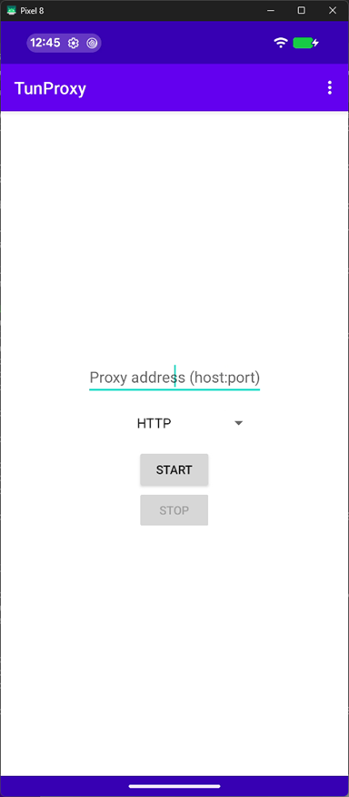
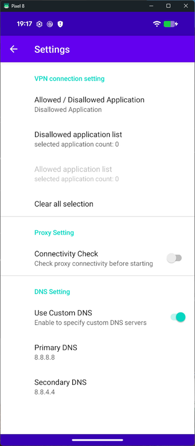
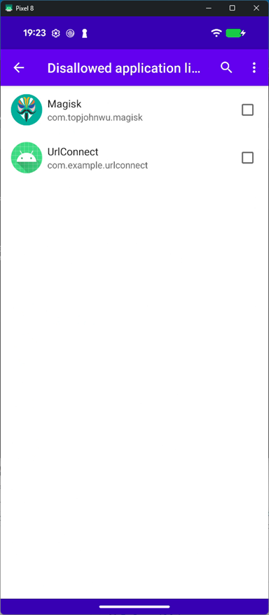
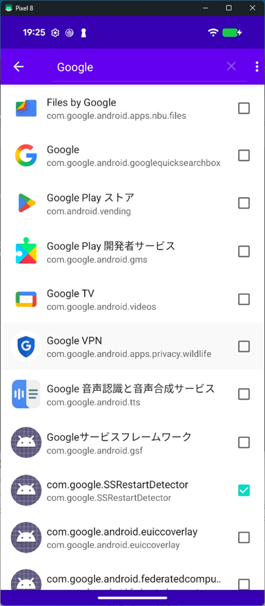
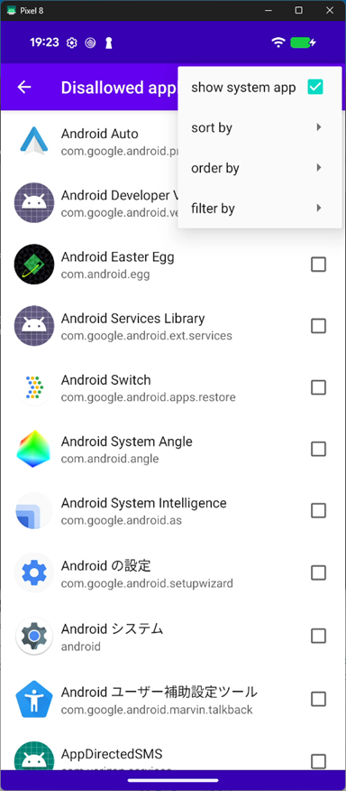

Android HTTP traffic Proxy setting tool
=============

Language/[Japanese](https://github.com/raise-isayan/TunProxy/blob/master/Readme-ja.md)

This tool is a proxy configuration tool that takes advantage of Android VPNService feature. 
Only the communication from the specified application can be acquired.

## How to use

When you start the TunProxy application, the following screen will be launched.

* Proxy address (host:port)
  * Specify the destination proxy server in the format ** host:port r**.
    The IP address must be described in IPv4 format.

* [Start] button
  * Start the VPN service.
* [Stop] button
  * Stop the VPN service.

## Menu

Application settings can be made from the menu icon () at the top of the screen.

## Settings

Configure VPN service settings.

 ⇒ 

## VPN connection setting

There are two modes, Disallowed Application and Allowed Application, but you can not specify them at the same time.
Because of this you will have to choose whether you want to run in either mode.
The default is **Disallowed Application** selected.

* Disallowed Application
  * Select the application you want to exclude from VPN service.
    The selected application will no longer go through VPN service and behave the same as if you do not use VPN.

* Allowed Application
  * Select the application for which you want to perform VPN service.
    The selected application will now go through VPN service.
    Applications that are not selected behave the same as when not using VPN.
    In addition, if none of them are selected, communication of all applications will go through VPN.

* Clear all selection
  * Clear all selections of Allowed / Disallowed application list.

### Settings Search

 / 

You can narrow down the applications from the search icon.()
Only applications that contain the keyword specified in the application name or package name will be displayed.

The application list can be sorted from the menu icon  () at the top of the screen.

### Settings Menu

Changed the way the application list is displayed.

* show system app
  * show system application

### sort by

* app name
  * Sort application list by application name

* package name
  * Sort application list by package name

### order by

* ascending
  * Sorting in ascending order

* descending
  * Sorting in descending order

### filter by

* app name
  * Search for the application name that contains the keyword you specified.

* package name
  * Search for the package name that contains the keyword you specified.

## Proxy setting
  Check proxy connectivity before starting

## DNS setting

Configure the DNS server settings.

* Use Custom DNS
  * Enable to specify custom DNS servers

* Primary DNS
  * Specify the primary DNS server.

* Secondary DNS
  * Specify the secondary DNS server.

## About

Display application version

## MITM (SSL decrypt)

TunProxy does not perform SSL decryption. TunProxy acts like a transparent proxy.
To perform SSL decryption, set the IP of an SSL decryptable proxy such as Burp suite or Fiddler to the IP of TunProxy

The following are local proxy tools that can decrypt SSL.

* Burp suite
  * https://portswigger.net/burp

* Fiddler
  * https://www.telerik.com/fiddler

* ZAP Proxy
  * https://www.zaproxy.org/

To decrypt SSL, install the local proxy tool Root certificate in the Android device user certificate.
However, in Android 7.0 and later, the application no longer trusts user certificates by default.

* https://android-developers.googleblog.com/2016/07/changes-to-trusted-certificate.html

Please refer to the following web site as a solution

* Android 7 Nougat and certificate authorities
  * https://blog.jeroenhd.nl/article/android-7-nougat-and-certificate-authorities

## Operating environment

* Android 6.0 (API Level 23) or later

### Build
 gradlew build

## Base application

Most of the code was created based on the following applications for creating applications.

* forked from MengAndy/tun2http
  * https://github.com/MengAndy/tun2http/

## Development environment

* JRE(JDK) 1.8 or later(Open JDK)
* AndroidStudio 2026.1.1 (https://developer.android.com/studio/index.html)
